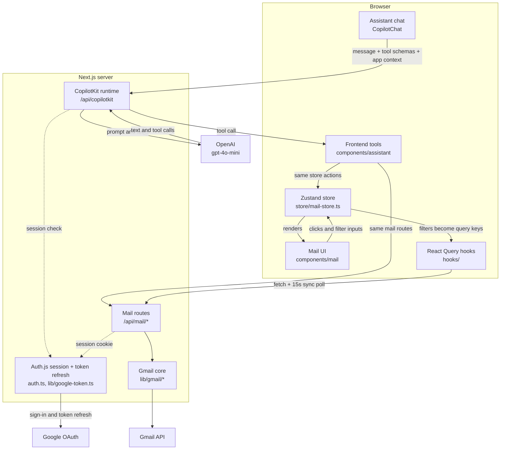

# AI Mail Copilot

**A Gmail client where the AI assistant works the interface for you. It filters the inbox, opens emails and types drafts into the compose card, and you can watch each step.**


**Live demo:** [ai-mail-copilot-liart.vercel.app](https://ai-mail-copilot-liart.vercel.app)

> **Note:** Google sign-in is in Testing mode, so only Google accounts approved as test users can log in. Opening the app to everyone would require Google to verify the app for its restricted Gmail scopes. To run it with your own inbox, follow [Getting started](#getting-started).

AI Mail Copilot is a working email client built on the Gmail API. The assistant isn't limited to answering questions in a chat panel; it operates the app itself. Ask for *"unread emails from this week"* and the real filter bar and inbox update. Ask it to *"write to team@example.com about tomorrow's meeting"* and the compose card opens and fills in one character at a time. The assistant can't send anything until you click **Send** on a confirmation card.

**Skills it demonstrates:** full-stack TypeScript with Next.js 16 · OAuth 2.0 sign-in and server-side token refresh · third-party API integration within quota limits · LLM tool calling and human-in-the-loop design (the AI pauses for a person's approval) · client state and server-cache management · handling untrusted HTML and email headers safely · unit testing.

**Contents**

- **Overview:** [Why this project is interesting](#why-this-project-is-interesting) · [What you can do](#what-you-can-do) · [The assistant's tools](#the-assistants-tools) · [What the assistant can see](#what-the-assistant-can-see) · [A request, end to end](#a-request-end-to-end) · [Architecture](#architecture)
- **Run & reference:** [Getting started](#getting-started) · [Environment variables](#environment-variables) · [Deploying to Vercel](#deploying-to-vercel) · [Scripts](#scripts) · [Testing](#testing) · [Key decisions](#key-decisions--trade-offs) · [Security](#security) · [Limitations](#limitations--possible-improvements) · [Project structure](#project-structure) · [Packages](#packages-and-why-each-is-used)

---

## Why this project is interesting

A common pattern for AI in email is a chatbot beside the inbox. This project takes a different approach: **the AI drives the same interface a person uses.**

- **One state, two drivers.** A single Zustand store (Zustand is a small shared-state library) in `store/mail-store.ts` describes what is on screen. The filter bar, folder buttons and compose card change that store, and the assistant's tools change it through the same store actions. "The user clicked Unread" and "the assistant filtered to unread" are the same state change, so both give the same result.
- **No special access for the AI.** Every tool calls an existing store action or an existing `/api/mail` route, and those routes require the user's signed-in session on the server. The only tools that can affect the app are its 10 registered ones (details in [Security](#security)). None of them can delete or archive mail, or change labels beyond read/unread.
- **You stay in control.** A send started by the assistant goes through a confirmation card that pauses the conversation until you click. If you click into the compose card while the assistant is typing, the draft completes at once and you can edit it.
- **Real Gmail, handled carefully.** Replies land in the original Gmail conversation, and outgoing headers are protected against injection. New mail is picked up by a 15-second poll of Gmail's history API (a list of changes since a saved checkpoint), which recovers on its own when the checkpoint expires. Email HTML is sanitized on the server, and Google tokens stay in an encrypted, httpOnly cookie.
- **Small enough to read.** The whole AI backend (model, prompt and auth guard) is one route file. The Gmail logic lives in a React-free `lib/gmail/` layer with unit tests.

## What you can do

### Read and search

- Browse **Inbox** and **Sent** with real Gmail data. Each row shows an initials avatar, the sender, the date, the subject, a one-line snippet and an unread dot.
- Use the **filter bar**: a "Search mail…" box, a "From…" box, "After date" and "Before date" pickers, an **Unread** toggle, and a **Clear** button that appears whenever a filter is active. The text boxes apply when you press Enter or leave the field, so Gmail isn't queried on every keystroke.
- Read mail in the **reading pane**, which shows sanitized HTML (or plain text) with **Reply** and **Forward** buttons. Opening an unread email marks it read in Gmail.
- See **updates without refreshing.** New mail, and read/unread changes made elsewhere (for example in Gmail itself), appear within about 15 seconds.

### Write and send

- A Gmail-style **compose card** with To, Cc, Subject and body. It can be minimized to a slim bar and restored.
- **Reply** fills in the sender's Reply-To address when one is set (otherwise the From address) and a "Re:" subject that doesn't stack. The reply is threaded into the original Gmail conversation.
- **Forward** adds a "Fwd:" subject and a `---------- Forwarded message ----------` block with the original's From, Date, Subject, To and text.

### Ask the assistant

The **✦ Assistant** panel is open by default. Type a request, for example:

| You type | What you see |
|---|---|
| `show me my unread emails` | The **Unread** toggle turns on and the list refreshes. |
| `open the latest email from Amazon` | The list narrows, then the email opens in the reading pane. |
| `write an email to team@example.com about tomorrow's meeting` | The compose card opens and its fields fill in one character at a time. |
| `send it` | A **Send this email?** card appears in the chat. Nothing is sent until you click **Send**. |

Every tool and what it does on screen is listed in [The assistant's tools](#the-assistants-tools).

### Everyday polish

- Dark mode with no flash of the wrong theme on load. It follows the OS setting by default and remembers a theme you pick yourself.
- Skeleton loaders, a "No emails match the current filters." empty state, a **Retry** button on errors, and a **Sign in again** button when the session has expired.

## The assistant's tools

The assistant acts on the app only through these 10 tools. They are *frontend tools*: functions the model can ask the browser to run. Nine are registered with `useFrontendTool` in `components/assistant/AssistantTools.tsx`. The tenth, `sendEmail`, is registered with `useHumanInTheLoop` in `components/assistant/ConfirmSendCard.tsx`. Each handler changes things through the same store actions and `/api/mail` routes the UI uses, then returns a short text result, which the model uses to tell you what happened.

Here, "assistant" means the chat feature, "model" means `gpt-4o-mini`, and the "agent" is the runtime loop that lets the model call tools; one step is one model response.

| Tool | Example request | What happens on screen |
|---|---|---|
| `composeEmail` | "Draft a message to team@example.com moving tomorrow's meeting to 3pm" | A compose card opens titled **Assistant is drafting…**, To, Cc, Subject and Body fill in as the assistant types, and the title changes to **New message** when it finishes. The model is told that you review the draft and send it yourself. |
| `updateComposeDraft` | "Make the body shorter and more formal" | Only the fields the model passes are retyped in the open card; the rest stay as they are. If no card is open, the tool tells the model to use `composeEmail` instead. |
| `applyFilters` | "Show unread emails from GitHub" | The **Unread** toggle and **From…** box update and the list refreshes. The new filters are added to the current ones, and any open email closes. The tool also takes subject, free text, after/before dates, folder, and raw Gmail operators such as `has:attachment`. |
| `clearFilters` | "Clear the filters" | Every filter except the current folder resets. The inputs empty out and the full list comes back. |
| `openEmail` | "Open the one from Amazon" | The email opens in the reading pane and is marked read if it was unread. |
| `replyToEmail` | "Reply to this saying thanks, I'll take a look" | A **Reply** card opens, addressed to the Reply-To address or the sender, with a "Re:" subject, a "Replying in thread" note, and the body filled in. It replies to the open email unless told otherwise. |
| `forwardEmail` | "Forward this to team@example.com with a note saying FYI" | A card opens with a "Fwd:" subject. Your note is filled in above the forwarded-message block. |
| `navigate` | "Go to my sent folder" | **Sent** is highlighted, filters reset, any open email closes, and the list shows sent mail. |
| `markRead` | "Mark the first three emails as read" | Unread dots and bold text update. It accepts up to 25 email ids and can also mark emails as unread, which no UI button does. |
| `sendEmail` | "Send it" | A **Send this email?** card appears in the chat with To, Subject, a body preview, and **Cancel** / **Send** buttons. The conversation waits for your click, then shows "Email sent ✓" or "Cancelled — nothing was sent." |

Only `sendEmail` draws a card in the chat. The other nine tools show their results in the mail interface itself, and the assistant describes them in text.

**Multi-step requests work in one message.** The agent may take up to 10 steps (`maxSteps: 10`). `applyFilters` returns the top 5 matches with their ids, and the model can pass one straight to `openEmail`. That is how "find the email from Amazon and open it" works.

**Prompt rules versus code guarantees.** The system prompt in `app/api/copilotkit/[[...path]]/route.ts` has 9 rules. Among other things, they tell the model to:

- clear filters before an unrelated search
- write mail with `composeEmail`, `replyToEmail` or `forwardEmail` instead of printing drafts in the chat
- show a draft before calling `sendEmail`
- turn phrases like "last week" into dates
- never claim an action it didn't take

The model normally follows these rules, but they are instructions, not checks. The code guarantees two things: the only tools that affect the app are these 10, and an email the assistant sends always needs your click.

## What the assistant can see

`components/assistant/AssistantContext.tsx` shares six pieces of live app state with the model through `useAgentContext`:

| Context | What it contains | What it makes possible |
|---|---|---|
| Today's date | `YYYY-MM-DD` (UTC) | "emails from last week" |
| The user | The signed-in email address and name, described as the sender of all outgoing mail | Knowing who the mail is from |
| Current view | Folder, the full filters object, a plain-English summary of the filters, the open email's id, and whether compose is open | "clear the filters", "go back to the inbox" |
| Visible emails | The top 20 emails in the current list: id, sender name and email, subject, date, unread flag, and a snippet cut to 120 characters | "open the one from Amazon", "mark these as read" |
| Open email | id, from, to, subject, date, and the first 800 characters of the plain-text body (or the snippet), or "no email is open" | "reply to this", "what is this email about?" |
| Compose draft | To, Cc, Subject and Body, or "compose is closed" | "make the body friendlier" |

The model never sees the whole mailbox or attachments, and it gets only the first 800 characters of the open email. The exception is the compose draft, which is shared in full, so a forwarded message's quoted body does reach the model. Tools and context are registered inside the assistant panel, so closing the panel switches the assistant off until you reopen it.

## A request, end to end

Here is what happens when you type **"show unread emails from GitHub this week"**:

1. **Chat to server.** CopilotKit's `CopilotChat` sends the conversation, the parameter schemas of the 10 tools (written with zod, a schema library) and the six context entries to the CopilotKit runtime under `/api/copilotkit` (a catch-all route that serves the runtime's sub-paths).
2. **Auth check.** The route calls `auth()` and returns `401 Unauthorized` if there is no signed-in session, so strangers can't spend the OpenAI credit.
3. **The model decides.** `BuiltInAgent` sends everything to `gpt-4o-mini` along with the system prompt, at temperature 0.2. It uses today's date from the context to work out "this week" and replies with a tool call, for example `applyFilters({ unreadOnly: true, from: "GitHub", after: "2026-09-08" })`.
4. **The tool runs in the browser.** The `applyFilters` handler calls `store.setFilters(...)`, the same action the filter bar uses.
5. **The screen updates.** The **Unread** toggle turns on, the **From…** box shows "GitHub", the **After date** picker fills in, and a **Clear** button appears.
6. **Data is fetched again.** `useEmailList` builds its React Query key from the filters through `buildGmailQuery()`, giving `['messages', 'inbox', 'is:unread from:GitHub after:2026/09/08']`. The key has changed, so React Query calls `GET /api/mail/messages?folder=inbox&q=…`.
7. **The server talks to Gmail.** `getGmail()` decrypts the session cookie and refreshes the Google access token if 60 seconds or less remain. The route then calls `messages.list` for the `INBOX` label (up to 25 results) and fetches the From/To/Subject/Date headers of each message, 10 requests at a time.
8. **The result goes back to the model.** The handler loads the list through the same React Query cache key and returns a line such as `Main list now shows 7 emails (unread only, from "GitHub", after 2026-09-08). Top results: "…" from GitHub [id …]`.
9. **The model sums up.** It uses its next step to write a short summary of what's on screen. If the request had ended with "…and open the newest one", it would call `openEmail` with an id from that result.

## Architecture



**The core idea** (see [Why this project is interesting](#why-this-project-is-interesting)): the UI and the assistant's tools change the same store, so both go through the same `buildGmailQuery()`, the same React Query cache keys and the same reply/forward helpers. A bug fixed in one of those places is fixed for both.

**Dependencies point one way:**
`components/assistant` → `store/` + `hooks/` → `app/api/mail/*` → `lib/gmail/*`

| Layer | Responsibility |
|---|---|
| `components/mail`, `components/assistant` | The UI and the AI tools. They work through the store, the hooks and the `/api/mail` routes. |
| `store/mail-store.ts` | The shared UI state: filters (including the folder), the open email, the compose draft, the sync checkpoint (Gmail `historyId`), and whether the assistant panel is open. |
| `hooks/` | React Query (fetching and caching for server data): list and detail queries, send and mark-read mutations, and the 15-second sync poll. |
| `app/api/mail/*` | Mail routes. Each one calls `getGmail()` before touching Gmail, which returns 401 without a valid session. |
| `lib/gmail/*` | Gmail core with no React: query building, MIME (the raw text format of an email), parsing, sanitizing and sync. |
| `app/api/copilotkit/[[...path]]` | The only AI backend. It never calls Gmail. |

### API routes

All mail access goes through four `/api/mail` routes; Auth.js and CopilotKit each have one catch-all route.

<details>
<summary><strong>Route reference</strong></summary>

| Route | What it does |
|---|---|
| `GET /api/mail/messages?folder=&q=&pageToken=` | Lists up to 25 messages and returns `{ emails, nextPageToken }`. The folder (`sent`; anything else means inbox) is sent to Gmail as a label id, not inside `q`. |
| `GET /api/mail/messages/[id]` | Returns the full message: sanitized HTML, plain text, Cc, Reply-To, and the Message-ID and References headers. |
| `PATCH /api/mail/messages/[id]` | Takes `{ read }` and removes or adds Gmail's `UNREAD` label. |
| `POST /api/mail/send` | Takes `{ to, cc?, subject, body, threadId?, inReplyTo?, references? }` and returns `{ id, threadId }`. Returns 400 if `to` is blank. |
| `GET /api/mail/sync?historyId=` | Returns `{ historyId, changedIds, fullResync }` for the sync poll. |
| `GET` and `POST /api/auth/[...nextauth]` | Auth.js sign-in, callback, session and sign-out. These are public by design. |
| `GET` and `POST /api/copilotkit/[[...path]]` | The CopilotKit runtime. Requires a signed-in session. |

An expired or missing session returns `401` with "Session expired — please sign in again." Other Gmail errors are passed back with Gmail's own status code and message.

</details>

### How background sync works (15-second polling)

Every 15 seconds the client asks the server what changed in Gmail since the last checkpoint, and reloads when something did.

<details>
<summary><strong>Sync steps</strong></summary>

1. **First poll.** There is no checkpoint yet, so the server takes a starting `historyId` from `users.getProfile`.
2. **Every 15 seconds** (background tabs included), the client sends the checkpoint back. The server calls `users.history.list` for `messageAdded`, `labelAdded` and `labelRemoved` events, reads every page of results, and returns the changed message ids plus the newest `historyId`.
3. **If anything changed,** the client invalidates all cached lists and message details, so what's on screen reloads and the rest reloads the next time it's shown.
4. **If the checkpoint is too old,** Gmail returns HTTP 404 (Google says history is *typically* available for at least one week). The server gets a fresh starting point, returns `fullResync: true`, and the client reloads everything.

</details>

### How reply threading works

Replies from both the Reply button and the `replyToEmail` tool meet all three requirements in Google's [threads guide](https://developers.google.com/workspace/gmail/api/guides/threads) for joining a conversation.

<details>
<summary><strong>The three requirements</strong></summary>

1. the `threadId` is set on the send request
2. `In-Reply-To` is set to the original's `Message-ID`, and `References` to the original's References plus that Message-ID (as the RFC 2822 email standard describes)
3. the subject matches (a "Re:" prefix that doesn't stack)

</details>

### Tech stack

| Concern | Choice |
|---|---|
| Framework | Next.js 16 (App Router) + React 19 + TypeScript |
| Styling | Tailwind CSS v4 (class-based dark mode) |
| Mail | Gmail API (`googleapis`) |
| Auth | Auth.js v5 (beta): Google OAuth, JWT sessions, no database |
| AI | CopilotKit v2 (`BuiltInAgent`) + OpenAI `gpt-4o-mini` |
| Client state | Zustand |
| Server data | TanStack React Query |
| Sanitizing | `sanitize-html` |
| Tests | Vitest |

## Getting started

**Prerequisites:** Node.js 20.9 or newer (required by Next.js 16), a Google account, a Google Cloud project, and an OpenAI API key.

### 1. Clone and install

```bash
git clone https://github.com/Sahitimutyala/ai-mail-copilot.git
cd ai-mail-copilot
npm install
```

### 2. Set up Google Cloud (OAuth + Gmail API)

1. Create a project at [console.cloud.google.com](https://console.cloud.google.com).
2. Go to **APIs & Services → Library** and enable the **Gmail API**.
3. Configure the **OAuth consent screen** (Google Auth Platform): audience **External**, publishing status **Testing**. Add every Gmail address that should be able to sign in as a **test user**.
4. Go to **Credentials → Create credentials → OAuth client ID → Web application** and set:
   - Authorized JavaScript origin: `http://localhost:3000`
   - Authorized redirect URI: `http://localhost:3000/api/auth/callback/google`
5. Copy the **Client ID** and **Client secret**.

At sign-in the app asks for the scopes `openid`, `email`, `profile`, `gmail.modify` and `gmail.send`. It also requests offline access with a forced consent prompt, so Google always issues a refresh token.

### 3. Configure environment variables

```bash
cp .env.example .env.local
```

Fill in `.env.local` (see [Environment variables](#environment-variables)). `.env.local` is gitignored and must never be committed.

### 4. Run

```bash
npm run dev
```

Open [http://localhost:3000](http://localhost:3000) and sign in with a Google account that is listed as a test user. Grant the Gmail permissions when asked. While the app is in Testing mode, Google shows an "unverified app" notice; choose **Continue**.

### 5. Check your setup (optional)

```bash
npm test
npm run lint
```

## Environment variables

| Variable | Required | Purpose | Where to get it |
|---|---|---|---|
| `AUTH_SECRET` | Yes | Encrypts the Auth.js session cookie, which holds the Google tokens | `npx auth secret`, or any random string of 32+ characters |
| `AUTH_GOOGLE_ID` | Yes | Google OAuth client ID | Google Cloud → Credentials |
| `AUTH_GOOGLE_SECRET` | Yes | Google OAuth client secret, used for sign-in and server-side token refresh | Google Cloud → Credentials |
| `OPENAI_API_KEY` | Yes | Lets the CopilotKit runtime call `gpt-4o-mini` | [platform.openai.com/api-keys](https://platform.openai.com/api-keys) |
| `COPILOTKIT_TELEMETRY_DISABLED` | No | Turns off CopilotKit's anonymous, sampled runtime telemetry (`DO_NOT_TRACK` also works) | `true` or `1` |
| `AUTH_TRUST_HOST` | Only for `npm start` or self-hosting | Lets Auth.js trust the request host behind a proxy. Not needed on Vercel or with `npm run dev`. | `true` |

## Deploying to Vercel

No `vercel.json` is required; Vercel detects Next.js automatically.

1. In the [Vercel dashboard](https://vercel.com/new), **import** this GitHub repository.
2. Under **Settings → Environment Variables**, add `AUTH_SECRET`, `AUTH_GOOGLE_ID`, `AUTH_GOOGLE_SECRET`, `OPENAI_API_KEY`, and optionally `COPILOTKIT_TELEMETRY_DISABLED=true`. Generate a fresh `AUTH_SECRET` for production. `AUTH_TRUST_HOST` isn't needed on Vercel.
3. **Deploy**, then note the production domain (for example `https://<project>.vercel.app`).
4. In Google Cloud → **Credentials → your OAuth client**, add:
   - Authorized JavaScript origin: `https://<your-domain>`
   - Authorized redirect URI: `https://<your-domain>/api/auth/callback/google`
5. Add everyone who should be able to sign in as a **test user** on the OAuth consent screen.

Notes:

- Changes to environment variables only take effect after a **redeploy**.
- Google only accepts registered redirect URIs. Sign-in works on the production domain you added, but not on per-commit preview URLs unless you register those too.
- The assistant endpoint requires a signed-in session, but every request still spends real OpenAI credit. Set a monthly usage limit in the OpenAI dashboard.

## Scripts

| Command | What it does |
|---|---|
| `npm run dev` | Start the development server on http://localhost:3000 |
| `npm run build` | Type-check and create a production build |
| `npm start` | Serve the production build (set `AUTH_TRUST_HOST=true` locally) |
| `npm run lint` | Run ESLint |
| `npm test` | Run the Vitest unit tests once |

## Testing

```bash
npm test
```

The unit tests focus on the pure functions in `lib/gmail/`, where a subtle bug would quietly corrupt real mail:

| Test file | What it covers |
|---|---|
| `tests/query.test.ts` | `buildGmailQuery()`: quoting multi-word terms, converting dates to Gmail's format, a stable order for combined filters, passing raw operators through; plus `toGmailDate()` and `hasActiveFilters()` |
| `tests/mime.test.ts` | Header-injection safety (a `Bcc:` smuggled into To with CR/LF line-break characters), `In-Reply-To`/`References` threading headers, non-ASCII subjects encoded per RFC 2047, non-stacking Re:/Fwd: subjects, and a reversible base64url encoding |
| `tests/parse.test.ts` | Address parsing (including quoted display names), extracting bodies from nested MIME trees, decoding entities in snippets, case-insensitive header lookup, and mapping Gmail messages to list rows |

There are no automated tests yet for the HTML sanitizer, sync, token refresh, the API routes, the UI components or the assistant tools.

## Key decisions & trade-offs

- **Next.js route handlers instead of a separate backend.** The server side is thin (OAuth, a Gmail wrapper and the AI runtime), and both `googleapis` and CopilotKit are JavaScript-first. That means one repo, one language, shared types, no CORS setup, and a Vercel deploy with no configuration.
- **Frontend tools instead of server-side tools.** The assistant's actions run in the browser through the store, so every action is visible and takes the same code path as a click. Tool handlers stay single-turn: they change state and return a string, which avoids a known CopilotKit problem with nested agent runs (issue #4106). The trade-off is that the assistant only works while its panel is open.
- **Confirmation only where it matters.** Filtering, opening and drafting are easy to undo, so they happen immediately. Sending can't be undone, so an assistant-started send waits for a click.
- **CopilotKit v2, pinned exactly.** Its hooks map directly onto actions, visible context and a human-in-the-loop step. Why the exact pin matters: see [Packages](#packages-and-why-each-is-used).
- **OpenAI `gpt-4o-mini` at temperature 0.2.** It is fast and inexpensive and handles tool calls well, and the low temperature keeps tool use consistent. The model is set by a single string. The runtime also understands prefixes such as `anthropic/` and `google/`, so switching providers means changing that string and setting the matching API key.
- **Polling before push.** A `users.history.list` call costs 2 Gmail quota units, so a 15-second poll uses about 8 units per minute per open app. It works the same locally and on Vercel with no extra infrastructure. Push (Gmail `users.watch` → Pub/Sub → webhook) could be added on top, keeping the poll as a fallback.
- **Headers for the list, full body on open.** The list only needs headers, so it requests metadata only, 10 messages at a time. The full body is fetched when an email is opened and cached for 5 minutes. Cost check against Google's current quota table: `messages.list` is 5 units and `messages.get` is 20, so a 25-row list load costs about 505 units of Gmail's limit of 6,000 units per user per minute (per project).
- **JWT sessions, no database.** The session lives in an encrypted cookie, so no database is needed; Google tokens are kept there and refreshed on the server. Refreshes are cached in memory and deduplicated, so requests that arrive together share one call to Google. The trade-off is that nothing is stored between sessions, and the refresh cache belongs to a single server instance.
- **Sanitize on the server.** Email HTML is cleaned before the JSON response leaves the server, so the browser never receives the raw markup.

## Security

### In place

- **Token storage.** Google access and refresh tokens are kept only inside Auth.js's session cookie, which is encrypted (JWE), `httpOnly` and `SameSite=Lax`, so browser JavaScript can't read it. The session visible to the client (`/api/auth/session`) carries only the user's basic profile (name, email, image), the expiry time and a refresh-error flag, never tokens. Server code decrypts the cookie on each request.
- **Server-only modules.** `lib/gmail/client.ts` and `lib/google-token.ts` import `server-only`, so the build fails if browser code imports them.
- **Per-route auth.** Every mail route calls `getGmail()` before touching Gmail, which returns 401 without a valid session. The AI endpoint checks `auth()` and returns 401 for anonymous requests, and it never calls Gmail itself.
- **Limited AI actions.** The only tools that affect the app are the 10 registered ones, and they use the same store actions and API routes as the UI. CopilotKit's `BuiltInAgent` also offers the model two built-in state tools, `AGUISendStateSnapshot` and `AGUISendStateDelta`, which edit the agent's own state object and can't reach mail, the store or the routes. There is no delete or archive tool, and a send started by the assistant always requires a click on the confirmation card.
- **HTML sanitizing** (`lib/gmail/sanitize.ts`, run on the server):
  - scripts, iframes, forms, inputs, `<style>` and `on*` event handlers are removed
  - links may only use `http`, `https` or `mailto`, and every link opens in a new tab with `rel="noopener noreferrer"`
  - images may only load from `https` or `data:` URLs
  - inline CSS is limited to an allowlist, and `url()` backgrounds are rejected
- **Header-injection protection.** In outgoing mail, To, Cc, Subject, In-Reply-To and References have any CR/LF (line-break characters) replaced with a space, so a smuggled `Bcc:` line can't become a header. A unit test covers this for To.

### Known gaps

- There is no Content-Security-Policy and there are no custom security headers (`next.config.ts` is empty). Sanitized email HTML is inserted into the app's own page with `dangerouslySetInnerHTML`, not a sandboxed iframe.
- Remote `https` images in emails load automatically, so tracking pixels still work. There is no image proxy.
- Gmail API error messages and status codes are passed back to the client unchanged. Input validation on the routes is minimal; for example, `PATCH` doesn't check that `read` is a boolean.

## Limitations & possible improvements

| Limitation | Possible improvement |
|---|---|
| **Real-time is a 15-second poll, not push.** It keeps polling in background tabs, doesn't track deletions (`messageDeleted`), and any change reloads every cached list and message instead of just the changed ones. | Push through Gmail `users.watch` → Pub/Sub → webhook, keeping the poll as a fallback. Reload only the changed ids, and pause polling while the tab is hidden. |
| **The list shows the newest 25 matches, with no pagination.** The API already accepts `pageToken` and returns `nextPageToken`, but the UI never asks for the next page. | "Load more" or infinite scroll using the existing token. |
| **No conversation view.** Each message is listed and opened on its own. Replies are threaded in Gmail, but the app doesn't group them. | Group by `threadId` and add a thread view. |
| **Plain-text sending only.** No HTML body, attachments, Bcc or reply-all, and replies don't quote the original. Non-ASCII bodies are not given a matching transfer encoding. | Multipart messages with attachments, quoted replies, and a proper transfer encoding. |
| **Drafts live in browser memory.** They are lost on reload and aren't saved to Gmail Drafts, and only one compose card can be open at a time. Filters, the open email and the panel state also reset on reload. | Sync with the Gmail Drafts API, and keep view state in the URL. |
| **OAuth Testing mode.** Only listed test users can sign in, and refresh tokens expire after 7 days. The sign-in card then shows "Your session expired — please sign in again." | Google app verification for the restricted Gmail scopes. |

<details>
<summary><strong>More known gaps</strong></summary>

| Limitation | Possible improvement |
|---|---|
| **Inbox and Sent only.** There is no archive, delete, star, labels, spam, snooze, Drafts, Trash or All Mail. In Sent, rows show the From field (you) rather than the recipient. | Label-based folders and `messages.modify` actions. Show recipients in Sent. |
| **The chat confirmation card sends its own copy.** It sends the To/Subject/Body shown on the card, not later edits made in the compose card, and it doesn't include Cc. It also takes reply-threading headers from whatever compose draft is open, so a different email sent while a reply draft is open would be threaded into that conversation. The compose card's own **Send** button does send Cc and your edits. | Have the card read the live draft, including `cc`, and only thread when the send matches the reply draft. |
| **Limited assistant scope.** It works only while its panel is open. It sees the top 20 visible emails and the first 800 characters of the open email. "Today" is the UTC date, so it can be off by a day near midnight. Only sends get a card in the chat. | Register tools at app level, share the user's local date, and add chat renderers for other tools. |
| **Desktop-first layout** with fixed-width columns. | A responsive layout for small screens. |
| **Security hardening gaps** (listed under [Security → Known gaps](#known-gaps)). | CSP headers, sandboxed iframe rendering, a "load images" option or image proxy, and zod validation on the routes. |
| **Session handling.** The token-refresh cache is in memory per server instance, and any failed refresh, even a brief network error, sends the user back to the sign-in screen. | Retry refreshes that fail for temporary reasons. |
| **Test coverage is limited to query building, MIME and parsing.** | Tests for the sanitizer, sync, token refresh, routes and assistant tools, plus end-to-end tests. |
| **Missing UI controls.** There is no mark-as-unread button, and no Subject or raw-query inputs in the filter bar. Only the assistant can do these. | Add the controls. |

</details>

## Project structure

The code is split by layer: `app/` for pages and API routes, `components/` for the mail UI and the assistant, `hooks/` and `store/` for client data and state, and `lib/` for the Gmail core and shared helpers.

<details>
<summary><strong>Full file tree</strong></summary>

```
.
├── app/
│   ├── api/
│   │   ├── auth/[...nextauth]/route.ts      Auth.js handlers (sign-in, callback, session, sign-out)
│   │   ├── copilotkit/[[...path]]/route.ts  CopilotKit runtime: BuiltInAgent, system prompt, auth guard
│   │   └── mail/
│   │       ├── messages/route.ts            GET list (folder, q)
│   │       ├── messages/[id]/route.ts       GET full message, PATCH read/unread
│   │       ├── send/route.ts                POST send (plain text, reply threading)
│   │       └── sync/route.ts                GET incremental history sync
│   ├── favicon.ico
│   ├── globals.css                          Tailwind v4 entry, class-based dark mode
│   ├── layout.tsx                           fonts, theme init script, providers
│   └── page.tsx                             sign-in screen or the mail app
├── components/
│   ├── assistant/
│   │   ├── AssistantPanel.tsx               right-hand panel with the embedded CopilotChat
│   │   ├── AssistantTools.tsx               the 9 useFrontendTool tools
│   │   ├── ConfirmSendCard.tsx              sendEmail human-in-the-loop confirmation card
│   │   ├── AssistantContext.tsx             app state shared with the model
│   │   └── typewriter.ts                    character-by-character draft fill
│   ├── mail/
│   │   ├── MailApp.tsx                      header, column layout, CopilotKitProvider
│   │   ├── FolderNav.tsx                    Compose, Inbox, Sent
│   │   ├── FilterBar.tsx                    search, from, dates, unread, clear
│   │   ├── EmailList.tsx                    list rows plus loading, empty and error states
│   │   ├── EmailDetail.tsx                  reading pane, Reply, Forward
│   │   ├── ComposeModal.tsx                 floating compose card
│   │   └── icons.tsx                        inline SVG icons (no icon library)
│   ├── providers.tsx                        TanStack Query client
│   └── theme.tsx                            no-flash theme script and toggle
├── hooks/
│   ├── use-mailbox.ts                       list and detail queries, mark read
│   ├── use-send.ts                          send mutation
│   └── use-sync.ts                          15-second sync poll
├── lib/
│   ├── gmail/
│   │   ├── client.ts                        getGmail(): session → Gmail client; auth errors → 401
│   │   ├── messages.ts                      list, detail, mark read/unread
│   │   ├── mime.ts                          outgoing message builder, header safety
│   │   ├── parse.ts                         headers, addresses, MIME body extraction
│   │   ├── query.ts                         buildGmailQuery(): filters → Gmail search syntax
│   │   ├── sanitize.ts                      email HTML allowlist
│   │   └── sync.ts                          history.list sync with 404 recovery
│   ├── google-token.ts                      access-token refresh with cache and in-flight dedup
│   ├── fetch-json.ts                        JSON fetch helper that throws ApiError with the HTTP status
│   ├── format.ts                            dates, initials, forward quote block
│   └── types.ts                             shared types (emails, filters, folders)
├── public/                                  default static SVG assets
├── store/mail-store.ts                      Zustand store: the shared UI state
├── tests/                                   Vitest unit tests: query, mime, parse
├── auth.ts                                  Auth.js config: Google provider, scopes, JWT callbacks
├── .env.example                             names of the required environment variables
├── .gitignore
├── eslint.config.mjs · next.config.ts · postcss.config.mjs · tsconfig.json · vitest.config.ts
├── package.json · package-lock.json
└── README.md
```

</details>

## Packages and why each is used

Versions are the installed versions from `package-lock.json`. Packages marked **pinned** use an exact version in `package.json` (no `^` range). Dev dependencies are needed only for building, checking and testing.

**Why CopilotKit is pinned.** `@copilotkit/react-core` and `@copilotkit/runtime` each require their internal CopilotKit packages at exactly 1.62.1 and the pre-1.0 AG-UI protocol at exactly 0.0.57. The browser package and the server runtime must use the same protocol version, and the v2 API is still changing. Upgrade both packages together, on purpose, and retest. Avoid a blind `npm update`.

<details>
<summary><strong>All direct dependencies (versions, purpose, reason)</strong></summary>

**Framework**

| Package | Version | What it does | Why it's here |
|---|---|---|---|
| `next` | 16.2.10 (pinned) | Serves the pages and runs the server-side API routes. | One project holds both the React UI and the server code that talks to Gmail and OpenAI, and it deploys to Vercel with no extra setup. |
| `react` | 19.2.4 (pinned) | The component library the whole UI is built with. | Next.js and CopilotKit are both built on React, so the mail screens and the chat panel share one component model. |
| `react-dom` | 19.2.4 (pinned) | Renders React components to HTML, in the browser and on the server. | Required by Next.js, and must match `react` exactly. |

**AI**

| Package | Version | What it does | Why it's here |
|---|---|---|---|
| `@copilotkit/react-core` | 1.62.1 (pinned) | The chat panel (`CopilotChat`), `CopilotKitProvider`, and the hooks that let the AI see app state and use its actions. | The v2 hooks match the design directly: `useFrontendTool` (actions), `useAgentContext` (what the AI sees) and `useHumanInTheLoop` (confirm before sending). |
| `@copilotkit/runtime` | 1.62.1 (pinned) | The server-side runtime that relays messages between the chat and OpenAI and streams the replies back. | `BuiltInAgent` sets up the model, prompt and tool loop in a few lines, and `createCopilotRuntimeHandler` fits into one catch-all route. |
| `zod` | 3.25.76 | Defines the shape of each tool's parameters. | CopilotKit turns these schemas into the tool definitions the model receives. zod 3.25 satisfies all of them: CopilotKit's runtime depends on zod 3, and the AI SDK accepts 3.25+ (or 4). |

**Gmail, auth and safety**

| Package | Version | What it does | Why it's here |
|---|---|---|---|
| `googleapis` | 173.0.0 | Google's official client for the Gmail API: list, get, modify, send, history. | Typed Gmail v1 methods and `gmail_v1` types keep request and response shapes type-checked. |
| `next-auth` | 5.0.0-beta.31 | "Sign in with Google" and the encrypted session cookie (Auth.js v5). | Supports Next 16, includes a Google provider, and keeps Google's access and refresh tokens in an encrypted httpOnly cookie that browser JavaScript can't read. |
| `sanitize-html` | 2.17.5 | Strips dangerous markup from incoming HTML emails. | Emails come from strangers. An allowlist applied on the server blocks script injection while keeping normal formatting. |
| `server-only` | 0.0.1 | Makes the build fail if a server file is imported into browser code. | `lib/gmail/client.ts` and `lib/google-token.ts` handle tokens and secrets. If they were ever pulled into browser code, the build fails instead of leaking them. |

**UI state and data**

| Package | Version | What it does | Why it's here |
|---|---|---|---|
| `zustand` | 5.0.14 | A small shared store for the current folder, filters, open email and compose draft. | The UI and the AI tool handlers call the same store actions from anywhere, with no provider boilerplate. This is how the AI changes what you see. |
| `@tanstack/react-query` | 5.101.2 | Fetches from the app's own API, caches the results and keeps them fresh. | Handles loading and error states, caching, the 15-second sync poll, and refreshing the cache after a send or mark-read. |

**Styling (dev dependencies)**

| Package | Version | What it does | Why it's here |
|---|---|---|---|
| `tailwindcss` | 4.3.2 | Utility-class styling, such as `flex` or `bg-zinc-50`, written in the markup. | Styles a whole mail client, dark mode included, without separate CSS files. CopilotKit's v2 UI is also built on Tailwind. |
| `@tailwindcss/postcss` | 4.3.2 | The PostCSS plugin that compiles Tailwind classes into CSS. | The supported way to connect Tailwind v4 to Next.js (`postcss.config.mjs`). |

**Quality tooling (dev dependencies)**

| Package | Version | What it does | Why it's here |
|---|---|---|---|
| `typescript` | 5.9.3 | Type checking. | Emails, filters and tool arguments pass between the UI, API and AI layers, and types keep those layers in agreement. |
| `@types/node` | 20.19.43 | Types for Node built-ins such as `Buffer` and `process.env`. | The server code base64-encodes MIME with `Buffer` and reads configuration from `process.env`. |
| `@types/react` | 19.2.17 | Types for React components and hooks. | Checks props and hooks in every `.tsx` file. |
| `@types/react-dom` | 19.2.3 | Types for `react-dom`. | Expected by Next.js alongside `@types/react`. |
| `@types/sanitize-html` | 2.16.1 | Types for `sanitize-html` options. | The allowlist is security-sensitive, so typed options catch misspelled settings. |
| `eslint` | 9.39.4 | Lints the code (`npm run lint`). | Next 16 removed `next lint`, so ESLint 9 runs directly with a flat config. |
| `eslint-config-next` | 16.2.10 (pinned) | Next.js lint rules for React, hooks, Core Web Vitals and TypeScript. | Its version matches `next`, and its React Hooks rules catch common effect and state mistakes. |
| `vitest` | 4.1.9 | Runs the unit tests (`npm test`). | Runs TypeScript tests quickly with little setup and understands the `@/` import alias. |

</details>

<details>
<summary><strong>Behind the scenes:</strong> important packages installed as dependencies of the ones above</summary>

| Package | Version | Role |
|---|---|---|
| `ai` (Vercel AI SDK) | 6.0.218 | The engine inside `BuiltInAgent`: it streams the model's answer and runs the tool-calling loop. `maxSteps: 10` sets its step limit. |
| `@ai-sdk/openai` | 3.0.80 | The OpenAI connector. The runtime turns `"openai/gpt-4o-mini"` into an OpenAI model that reads its key from `OPENAI_API_KEY`. |
| `@ai-sdk/provider`, `@ai-sdk/provider-utils` | 3.0.13, 4.0.35 | Shared AI SDK building blocks that give every model connector the same interface. |
| `@copilotkit/core` | 1.62.1 | CopilotKit v2's framework-neutral client engine. The React v2 hooks are thin wrappers around it. |
| `@copilotkit/shared` | 1.62.1 | Helpers shared by the CopilotKit packages, including the telemetry opt-out check. |
| `@ag-ui/client`, `@ag-ui/core`, `@ag-ui/encoder` | 0.0.57 | The AG-UI protocol: the event format for streaming messages and tool calls between server and browser. |
| `@auth/core` | 0.41.2 | The authentication engine inside `next-auth`: the OAuth flow and session-cookie encryption. |
| `google-auth-library`, `googleapis-common` | 10.9.0, 8.0.2 | The auth and request layer under `googleapis`. `lib/gmail/client.ts` creates a `google.auth.OAuth2` client that holds only the access token. The token refresh itself is a plain `fetch` in `lib/google-token.ts`. |

`@copilotkit/react-core` also brings in the chat panel's rendering stack (`streamdown`, `react-markdown`, `katex`, `@radix-ui/react-*` primitives such as `@radix-ui/react-tooltip`, `lucide-react`, `tailwind-merge`). That is why `CopilotChat` shows formatted answers without extra entries in `package.json`.

</details>
