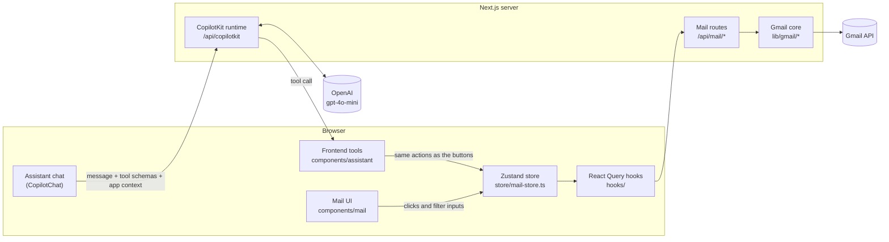

# Mail Copilot

**A Gmail client where an AI assistant drives the interface through natural language.**


Mail Copilot is not a chatbot that talks *about* your email — it operates the app. Say
*"send an email to john@example.com about tomorrow's meeting"* and the compose window opens
and visibly fills in; say *"show unread emails from this week"* and the real inbox filters.

It runs on the **Gmail API** with Google sign-in, so it works with real mail — reading,
searching, sending, and replying with correct threading.

---

## Features

| Capability | How it works |
|---|---|
| **Real mail** — read, search, send, reply | Gmail API via `googleapis`, Google OAuth sign-in |
| **Assistant writes emails in the compose form** | Frontend tool `composeEmail` + a visible typewriter fill |
| **Assistant filters the main inbox** | Tool `applyFilters` updates the same store the UI renders from |
| **Context-aware** — "reply to this" knows the open email | Live app state shared with the model via `useAgentContext` |
| **Human-in-the-loop sending** | `useHumanInTheLoop` confirmation card — nothing is sent without a click |
| **Inbox & Sent with real data** | `messages.list` / `messages.get`, sanitized HTML rendering |
| **Near-real-time sync** — new mail appears without refresh | 15-second incremental `history.list` polling |
| **Manual filters too** — sender, dates, unread, search | Same store and query builder the assistant uses |
| **Reply & forward**, **dark mode** | Correct `In-Reply-To` / `References` threading; no-flash theme init |

### Try these commands

- `show me my unread emails`
- `find the email from Google about verification`
- `open the latest email from Amazon`
- `send an email to john@example.com with subject 'Meeting Tomorrow' and body 'Let's meet at 3pm'`
- `reply to this saying thanks, I'll take a look` (while reading an email)
- `show emails from the last 10 days`

---

## How it works



**The core idea:** one Zustand store describes everything on screen. Both the human UI
(buttons, filter inputs) and the assistant's tools change that *same* store, so "the AI
filters the inbox" and "the user clicks the Unread toggle" are the identical state
transition. The AI never gets privileged access — its tools are the same safe actions the
buttons call, and it never talks to Gmail directly.

**How a command flows:** a message typed into the chat is sent — together with the tool
schemas and a snapshot of the current app state — to the CopilotKit runtime route. OpenAI
(`gpt-4o-mini`) answers with a *tool call* such as `applyFilters({ unreadOnly: true })`. The
tool's handler runs in the browser and updates the store; React Query (keyed off the store's
filters) refetches from the mail API, and the UI re-renders.

Dependencies point one way only:
`components/assistant` → `store/` + `hooks/` → `app/api/mail/*` → `lib/gmail/*`.

### Tech stack

| Concern | Choice |
|---|---|
| Framework | Next.js 16 (App Router) + TypeScript |
| Styling | Tailwind CSS v4 (class-strategy dark mode) |
| Mail | Gmail API (`googleapis`) |
| Auth | Auth.js v5 (Google OAuth, JWT sessions — no database) |
| AI | CopilotKit v2 + OpenAI `gpt-4o-mini` |
| Client state | Zustand |
| Server data | TanStack React Query |
| Sanitization | `sanitize-html` |
| Tests | Vitest |

### Project structure

```
app/
  api/auth/[...nextauth]/     Auth.js route handlers (Google OAuth)
  api/copilotkit/[[...path]]/ CopilotKit runtime — the only AI backend route
  api/mail/                   list / detail / mark-read, send, incremental sync
  layout.tsx, page.tsx        app shell and sign-in screen
components/
  assistant/                  AI tools, app context, send confirmation, typewriter fill
  mail/                       folder nav, filter bar, email list, reading pane, compose
hooks/                        React Query data hooks and the 15s sync poll
lib/gmail/                    pure Gmail core: query, MIME, parsing, sanitizing, sync
store/mail-store.ts           Zustand store — single source of truth for the UI
tests/                        Vitest unit tests for lib/gmail
auth.ts                       Auth.js config: scopes and server-side token refresh
```

---

## Getting started

**Prerequisites:** Node.js 20.9 or newer, a Google account, a Google Cloud project, and an
OpenAI API key.

### 1. Clone and install

```bash
git clone https://github.com/Sahitimutyala/ai-mail-copilot.git
cd ai-mail-copilot
npm install
```

### 2. Set up Google Cloud (OAuth + Gmail API)

1. Create a project at [console.cloud.google.com](https://console.cloud.google.com).
2. **APIs & Services → Library** → enable the **Gmail API**.
3. Configure the **OAuth consent screen** (Google Auth Platform): audience **External**,
   publishing status **Testing**, and add every Gmail address that should be able to sign in
   as a **test user**.
4. **Credentials → Create credentials → OAuth client ID → Web application**:
   - Authorized JavaScript origin: `http://localhost:3000`
   - Authorized redirect URI: `http://localhost:3000/api/auth/callback/google`
5. Copy the **Client ID** and **Client secret**.

### 3. Configure environment variables

```bash
cp .env.example .env.local
```

Fill in `.env.local` (see [Environment variables](#environment-variables)). `.env.local` is
gitignored and must never be committed.

### 4. Run

```bash
npm run dev
```

Open [http://localhost:3000](http://localhost:3000), sign in with a Google account that is
listed as a test user, and grant the Gmail permissions when prompted. While the app is in
Testing mode, Google shows an "unverified app" notice — choose **Continue**.

---

## Environment variables

| Variable | Required | Purpose | Where to get it |
|---|---|---|---|
| `AUTH_SECRET` | Yes | Encrypts the Auth.js session cookie (which holds the Google tokens) | `npx auth secret`, or any random string of 32+ characters |
| `AUTH_GOOGLE_ID` | Yes | Google OAuth client ID | Google Cloud → Credentials |
| `AUTH_GOOGLE_SECRET` | Yes | Google OAuth client secret (sign-in and server-side token refresh) | Google Cloud → Credentials |
| `OPENAI_API_KEY` | Yes | Used by the CopilotKit runtime to call `gpt-4o-mini` | [platform.openai.com/api-keys](https://platform.openai.com/api-keys) |
| `COPILOTKIT_TELEMETRY_DISABLED` | No | Opts out of CopilotKit's anonymous telemetry | `true` |
| `AUTH_TRUST_HOST` | Only for `npm start` / self-hosting | Lets Auth.js trust the request host behind a proxy. Not needed on Vercel or with `npm run dev` | `true` |

---

## Deploying to Vercel

No `vercel.json` is required — Vercel detects Next.js automatically.

1. In the [Vercel dashboard](https://vercel.com/new), **import** this GitHub repository.
2. Under **Settings → Environment Variables**, add `AUTH_SECRET`, `AUTH_GOOGLE_ID`,
   `AUTH_GOOGLE_SECRET`, `OPENAI_API_KEY`, and optionally `COPILOTKIT_TELEMETRY_DISABLED=true`.
   Generate a fresh `AUTH_SECRET` for production. `AUTH_TRUST_HOST` is not needed on Vercel.
3. **Deploy**, then note the production domain (for example `https://<project>.vercel.app`).
4. In Google Cloud → **Credentials → your OAuth client**, add:
   - Authorized JavaScript origin: `https://<your-domain>`
   - Authorized redirect URI: `https://<your-domain>/api/auth/callback/google`
5. Add everyone who should sign in as a **test user** on the OAuth consent screen.

Notes:
- Changing environment variables requires a **redeploy** to take effect.
- Google only accepts redirect URIs that are registered, so sign-in works on the production
  domain you added — not on per-commit preview URLs unless you register those too.
- The assistant endpoint requires a signed-in session, but it still spends OpenAI credit —
  set a monthly usage limit in the OpenAI dashboard.

---

## Scripts

| Command | What it does |
|---|---|
| `npm run dev` | Start the development server on http://localhost:3000 |
| `npm run build` | Type-check and create a production build |
| `npm start` | Serve the production build (set `AUTH_TRUST_HOST=true` locally) |
| `npm run lint` | Run ESLint |
| `npm test` | Run the Vitest unit tests |

## Testing

```bash
npm test
```

The unit tests cover the logic most worth locking down — Gmail query building, MIME
construction (including reply threading and header-injection safety), and payload parsing.
Those pure functions in `lib/gmail/` are where a subtle bug would silently corrupt real mail.

---

## Key decisions & trade-offs

- **Next.js API routes instead of a separate backend.** The backend is thin (OAuth and a Gmail
  wrapper), and both the Gmail SDK and CopilotKit are JavaScript-first. One repo, one
  language, and shared types between client and server — no second service or CORS setup.
- **CopilotKit for the AI layer.** Its hooks map directly onto the product: `useFrontendTool`
  (the AI's actions), `useAgentContext` (what the AI can see), and `useHumanInTheLoop`
  (confirm-before-send). The tool/store architecture is framework-agnostic, so the AI layer
  could be swapped for the raw Vercel AI SDK without touching the UI.
- **OpenAI `gpt-4o-mini`.** Fast, inexpensive, and reliable at tool calling; changing
  provider is a one-line change in the runtime route.
- **Polling first for real-time.** A 15-second incremental `history.list` sync costs 2 quota
  units per call and works identically locally and in production with no extra
  infrastructure. Push (Gmail → Pub/Sub → webhook → browser) is the natural next tier.
- **JWT sessions, no database.** OAuth tokens live only in the encrypted session cookie and
  are never exposed to client JavaScript; server code reads them per request. Simple to run
  and deploy, at the cost of features a persistent token store would enable.

## Security

- Email HTML is **sanitized server-side** before it reaches the browser.
- Outgoing mail headers **strip CR/LF** to prevent header injection (e.g. a smuggled `Bcc`).
- OAuth tokens are **never sent to the browser** — only server code can decrypt the session.
- The assistant can only call registered tools (the same safe actions the UI uses), and
  **sending requires an explicit confirmation click**.
- The AI endpoint rejects requests without a signed-in session.

## Limitations & possible improvements

- **Drafts don't survive a page refresh** — the draft lives in browser memory; syncing to the
  Gmail Drafts API would fix this.
- **Real-time is polling, not push** — a Gmail `users.watch` → Pub/Sub → webhook pipeline
  would deliver new mail in about a second.
- **OAuth Testing mode** limits sign-in to listed test users and expires refresh tokens after
  7 days. Public use requires Google's app verification (Gmail scopes are restricted).
- **No pagination or thread grouping** in the list view yet; broader test coverage and
  optimistic UI for mark-as-read are next.
